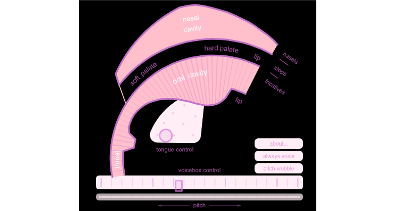

# Pink Trombone

This is a revised version of the Pink Trombone speech
synthesizer originally developed by Neil Thapen in 2017.
The original source code was modularized and converted to TypeScript.
Then the TypeScript code was converted to Rust.

Pink Trombone uses two-dimensional
[digital waveguide synthesis](https://en.wikipedia.org/wiki/Digital_waveguide_synthesis)
to synthesize human speech sounds.

**Online demo**: [chdh.github.io/pink-trombone-mod](https://chdh.github.io/pink-trombone-mod)

Screenshot: 

# Sample code

You can easily connect Pink Trombone to any audio framework, that accepts
`f32` inputs. [An example](examples/pink-trombone.rs) for
[rodio](https://github.com/RustAudio/rodio).

## Bibliographic references cited by Neil Thapen

- Julius O. Smith III, "Physical audio signal processing for virtual musical instruments and audio effects." 
  https://ccrma.stanford.edu/~jos/pasp/

- Story, Brad H. "A parametric model of the vocal tract area function for vowel and consonant simulation." 
  The Journal of the Acoustical Society of America 117.5 (2005): 3231-3254. 
  http://sal.arizona.edu/sites/default/files/story_jasa2005.pdf

- Lu, Hui-Ling, and J. O. Smith. "Glottal source modeling for singing voice synthesis." 
  Proceedings of the 2000 International Computer Music Conference, 2000.

- Mullen, Jack. Physical modelling of the vocal tract with the 2D digital waveguide mesh. 
  PhD thesis, University of York, 2006. 
  http://www-users.york.ac.uk/~dtm3/Download/JackThesis.pdf
